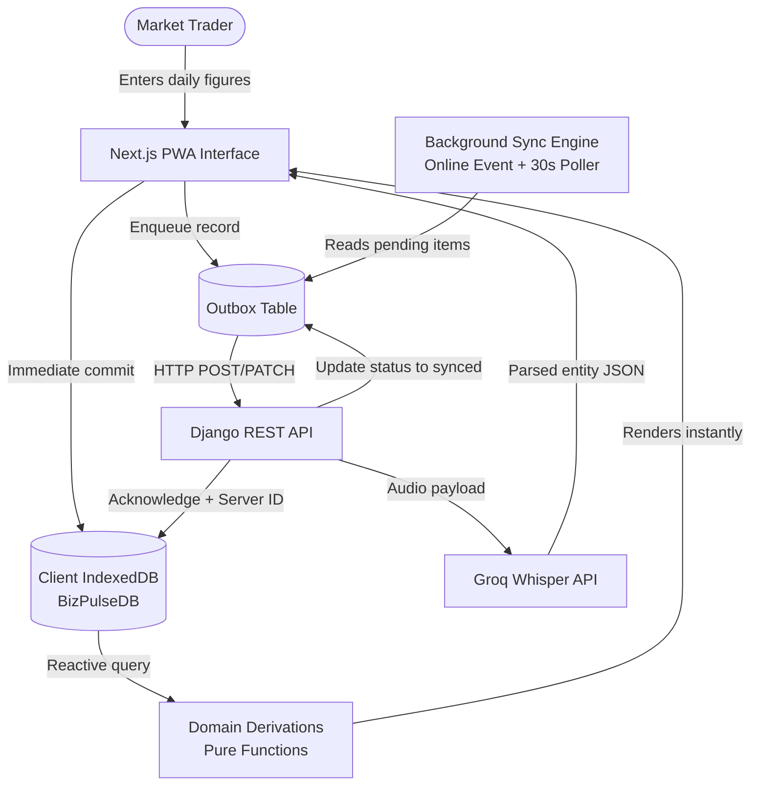

# BizPulse

> She keeps doing what she already does. We make sure it adds up to something she can show a lender.

BizPulse converts the daily macro tally an informal trader already calculates into a verified, durable financial record. It eliminates the friction of item-level inventory tracking, complex accounting software, and steep learning curves. Traders capture their daily figures in seconds, manage customer credit and repayments, and automatically accumulate a lender-ready financial history.

Built for the Borderless Bytes Hackathon by StacStart (FinTech and Commerce Track, 2026), grounded in direct field research with Nigerian market traders.

---

## Table of Contents

- [Problem and Market Reality](#problem-and-market-reality)
- [How It Works](#how-it-works)
- [Key Features](#key-features)
- [Repository Structure](#repository-structure)
- [Sub-project Documentation](#sub-project-documentation)
- [Tech Stack](#tech-stack)
- [Prerequisites](#prerequisites)
- [Quick Start Guide](#quick-start-guide)
  - [1. Backend Setup](#1-backend-setup)
  - [2. Frontend Setup](#2-frontend-setup)
  - [3. Running Both Services](#3-running-both-services)
- [Architecture Overview](#architecture-overview)
  - [Local-First Architecture](#local-first-architecture)
  - [Data Flow Diagram](#data-flow-diagram)
  - [Architectural Decisions](#architectural-decisions)
- [API Contract and Endpoints](#api-contract-and-endpoints)
  - [Authentication Endpoints](#authentication-endpoints)
  - [Business and Financial Endpoints](#business-and-financial-endpoints)
  - [Core Financial Formulas](#core-financial-formulas)
- [Design Philosophy](#design-philosophy)
- [Development and Testing](#development-and-testing)
  - [Type Checking](#type-checking)
  - [Frontend Tests](#frontend-tests)
  - [Backend Tests](#backend-tests)
- [Team and Attribution](#team-and-attribution)

---

## Problem and Market Reality

Most micro and small-scale traders in Nigerian markets calculate two key numbers at the close of every business day: total sales and the amount extended on credit. These figures are typically jotted down in pocket notebooks, memorized, or texted to self on WhatsApp. They do not log individual stock-keeping units (SKUs) because high transaction velocity makes per-item bookkeeping impractical.

The core challenge is not lack of record-keeping habit; it is durability and structure.

When a commercial bank, microfinance institution, or grant provider requests proof of business performance, traders have only informal estimates. Traditional bookkeeping software often fails in this market because it demands per-product cataloging, high English literacy, and complex accounting concepts.

BizPulse captures the macro figures traders already calculate, preserves them securely offline and online, and compiles them into a standardized, dated financial trail accepted by credit evaluators.

---

## How It Works

A typical day for a trader using BizPulse:

1. **Closing Tally**: At the end of the day, she opens BizPulse and enters three figures: total sales, business expenses, and credit given today. Input can be typed directly or spoken via voice.
2. **Customer Attribution**: If credit was extended, she assigns it to a customer profile along with an optional repayment due date.
3. **Instant Offline Persistence**: The transaction commits immediately to local device storage, operating reliably with or without an active internet connection.
4. **Automated Metrics**: The app compiles five financial figures: Revenue, Total Expenses, Net Business Result, Cash Position, and Outstanding Receivables, complete with period comparisons.
5. **Creditworthiness**: Over time, these daily entries form an exportable, audit-friendly financial track record suitable for loan and grant applications.

---

## Key Features

| Capability | Details |
|---|---|
| End-of-Day Quick Tally | Record total revenue, expenses, and credit extended in under 30 seconds. |
| Customer Credit Management | Track customer balances, partial repayments, payment history, and overdue status. |
| Debtor Follow-up Workflow | Ranked follow-up queue sorted by delinquency with pre-composed SMS and WhatsApp templates. |
| Financial Dashboard | Macro metrics (Revenue, Business Result, Cash In Hand, Debtors) with period-over-period trends. |
| Automated Plain-Language Insights | Contextual observations highlighting margin shifts, expense growth, and cash collection rate. |
| Natural Language Voice Entry | Optional speech transcription supporting English and Nigerian Pidgin for fast input. |
| 100% Offline-First (PWA) | Fully functional without internet connectivity via IndexedDB; background sync when online. |
| Lender Statement Export | Client-side CSV export formatted specifically for microfinance credit officers. |
| Realistic Demo Seeder | One-click seed function generating 60+ days of authentic Nigerian retail operational data. |
| Theme Support | System-aware light and dark modes with zero-flicker client-side initialization. |

---

## Repository Structure

This repository is organized as a monorepo containing decoupled frontend and backend services:

```text
BizPulse/
├── frontend/                   # Next.js Progressive Web App (PWA)
│   ├── app/                    # Next.js App Router (pages, layout, manifest)
│   ├── public/                 # PWA service worker, icons, web manifest
│   ├── src/
│   │   ├── api/                # HTTP clients for auth and data plane
│   │   ├── data/               # IndexedDB schema, outbox queue, sync engine, repositories
│   │   ├── domain/             # Pure calculation logic, financial derivations, CSV export
│   │   ├── state/              # React context and hooks (business, dashboard, sync, theme)
│   │   └── ui/                 # Screens, dialogs, forms, components, design tokens
│   ├── .env.example            # Frontend environment variable configuration
│   ├── package.json            # Node.js dependencies and script definitions
│   └── README.md               # Dedicated frontend documentation
│
├── backend/                    # Django REST Framework API
│   ├── accounts/               # User authentication, custom User model, business entities
│   ├── finance/                # Customers, tallies, credit records, repayments, server derivations
│   ├── ai/                     # Speech-to-text transcription service (Groq Whisper integration)
│   ├── myapp/                  # Django project settings, root routing, OpenAPI schema
│   ├── manage.py               # Django management script
│   ├── requirements.txt        # Python package dependencies
│   └── README.md               # Dedicated backend documentation
│
├── BizPulse-Project-Brief-v3.3.md # Comprehensive product specifications and research brief
└── README.md                   # Monorepo root documentation (this file)
```

---

## Sub-project Documentation

Detailed, service-specific instructions and deep dives are available in their respective directories:

- [frontend/README.md](file:///c:/Users/USER%20PC/Documents/BizPulse/frontend/README.md) covers UI architecture, IndexedDB schema (Dexie.js), outbox synchronization, voice parsing, Jest unit tests, and demo flows.
- [backend/README.md](file:///c:/Users/USER%20PC/Documents/BizPulse/backend/README.md) covers Django setup, database migrations, authentication flows, SimpleJWT token rotation, Groq Whisper configuration, and Swagger/OpenAPI documentation.

---

## Tech Stack

### Frontend Application
- Framework: Next.js 16 (App Router)
- Language: TypeScript 5 with React 19
- Local Storage: Dexie.js v4 (IndexedDB wrapper)
- Styling: Vanilla CSS with custom tokens and CSS custom properties (no Tailwind dependency)
- Offline & PWA: Custom Service Worker, Web App Manifest, offline cache fallback
- Unit Testing: Jest 29 and ts-jest

### Backend Application
- Framework: Python 3 with Django 5 and Django REST Framework (DRF)
- Authentication: SimpleJWT (stateless Bearer tokens with rotation and blacklisting)
- AI Transcription: Groq Whisper API (`whisper-large-v3-turbo`)
- API Documentation: drf-spectacular (OpenAPI 3.0 schema and Swagger UI)
- Database: SQLite (local development) / PostgreSQL (production)
- CORS: django-cors-headers

---

## Prerequisites

Before running the application locally, ensure you have the following installed:

- Node.js: v20.x or higher
- npm: v10.x or higher
- Python: v3.10 or higher
- Git: v2.x or higher

---

## Quick Start Guide

Clone the repository to your local workstation:

```bash
git clone https://github.com/QuorumBuilders/BizPulse.git
cd BizPulse
```

The frontend and backend run as independent services communicating over HTTP.

### 1. Backend Setup

Open a terminal and navigate to the backend folder:

```bash
cd backend

# Create and activate virtual environment
python -m venv .venv

# Windows (Command Prompt / PowerShell)
.venv\Scripts\activate

# macOS / Linux
source .venv/bin/activate

# Install Python dependencies
pip install -r requirements.txt

# Create environment configuration
# Duplicate the example environment file or create .env:
# Required keys: SECRET_KEY, DEBUG, ALLOWED_HOSTS, GROQ_API_KEY
```

Run database migrations:

```bash
python manage.py migrate
```

Start the backend development server:

```bash
python manage.py runserver
```

The API will be available at `http://127.0.0.1:8000`.  
Interactive API Documentation (Swagger): `http://127.0.0.1:8000/api/docs/`

### 2. Frontend Setup

Open a second terminal window and navigate to the frontend folder:

```bash
cd frontend

# Install dependencies
npm install

# Configure environment
# Windows PowerShell:
Copy-Item .env.example .env
# Linux / macOS / Git Bash:
cp .env.example .env

# Start frontend development server
npm run dev
```

The application will be accessible at `http://localhost:3000`.

### 3. Running Both Services

| Service | Working Directory | Command | URL |
|---|---|---|---|
| Backend API | `backend/` | `python manage.py runserver` | `http://127.0.0.1:8000` |
| Frontend Web App | `frontend/` | `npm run dev` | `http://localhost:3000` |

The frontend operates in full offline-first mode: even if the backend is stopped or unreachable, the user interface remains fully interactive with local storage and calculations. Once the backend starts, pending changes sync automatically.

---

## Architecture Overview

### Local-First Architecture

BizPulse uses a local-first architectural model. Every user action (recording a tally, creating a customer, logging a repayment) is committed immediately to the client IndexedDB database. The user interface updates instantaneously with zero network latency.



### Architectural Decisions

1. **IndexedDB as Primary Store**: Network connectivity in West African markets can be intermittent. The application treats client storage as the source of immediate truth; network transmission is an asynchronous synchronization detail.
2. **Outbox Pattern**: Mutations are appended to an outbox queue with status metadata (`pending`, `synced`, `failed`). This prevents data loss during browser crashes or connectivity drops.
3. **Idempotent Sync with UUIDs**: All client-generated records include a unique `client_id` (UUIDv4). The backend utilizes `client_id` to deduplicate retried sync requests without creating duplicate records.
4. **Dual Computation Invariants**: Financial metrics are computed using identical pure mathematical rules on both client (`frontend/src/domain/derivations.ts`) and server (`backend/finance/services.py`). Client-side calculations provide real-time UI responsiveness, while server-side evaluations ensure reporting consistency.
5. **Typing-First, Voice-Optional**: Field observations confirmed that speaking debtor identities and cash totals in crowded market settings introduces social and security concerns. Typing is the default input method, with voice available as an opt-in shortcut.

---

## API Contract and Endpoints

All authenticated routes require a valid JWT token passed in the request authorization header:

```http
Authorization: Bearer <jwt-access-token>
```

### Authentication Endpoints

Base path: `/api/auth/`

| HTTP Method | Route | Description |
|---|---|---|
| `POST` | `/api/auth/register/` | Register user account and trigger verification email |
| `POST` | `/api/auth/token/` | Authenticate user credentials and return access and refresh tokens |
| `POST` | `/api/auth/token/refresh/` | Refresh expired access token using valid refresh token |
| `POST` | `/api/auth/logout/` | Revoke and blacklist current refresh token |
| `POST` | `/api/auth/verify-email/` | Validate email address using verification token |
| `POST` | `/api/auth/verify-email/resend/` | Dispatch a new email verification link |
| `POST` | `/api/auth/password/change/` | Change password for authenticated session |
| `POST` | `/api/auth/password/reset/` | Request password reset email instructions |
| `POST` | `/api/auth/password/reset/confirm/` | Confirm password reset with token |

### Business and Financial Endpoints

Base path: `/api/businesses/{businessId}/`

| Resource | Methods | Endpoint Path |
|---|---|---|
| Businesses | `GET`, `POST`, `PATCH` | `/api/businesses/` and `/api/businesses/{id}/` |
| Customers | `GET`, `POST`, `PATCH` | `/api/businesses/{id}/customers/` and `.../{customerId}/` |
| Daily Tallies | `GET`, `POST`, `PATCH` | `/api/businesses/{id}/daily-tallies/` and `.../{tallyId}/` |
| Credit Records | `GET`, `POST`, `PATCH` | `/api/businesses/{id}/credits/` and `.../{creditId}/` |
| Repayments | `GET`, `POST` | `/api/businesses/{id}/credits/{creditId}/repayments/` |
| Voice Transcription | `POST` | `/api/ai/transcribe/` (Multipart audio file) |

Full OpenAPI specification and request/response payloads: `http://127.0.0.1:8000/api/docs/`

### Core Financial Formulas

The accounting equations implemented across the platform:

```text
Revenue         = Sum of (cash_sales + credit_sales) for the selected period
Business Result = Total Revenue - Total Expenses
Cash Position   = Initial Cash + Total Cash Sales + Total Repayments Received - Total Expenses
Outstanding     = Original Credit Amount - Total Repayments Received
Overdue Debt    = Outstanding Credit where current_date > due_date
```

---

## Design Philosophy

- **Respect Existing Habits**: Rather than requiring traders to adopt complex double-entry accounting or SKU catalogs, BizPulse formalizes their end-of-day tally routine.
- **Macro Clarity**: Business health, lender discussions, and working capital decisions rely on top-line revenue, net margins, receivables, and cash reserves—not granular barcode scans.
- **Zero-Friction Bankability**: By simply recording daily totals, traders passively build a structured, timestamped audit trail that can be exported directly for loan officers and trade credit evaluators.
- **Device Inclusivity**: Optimized for entry-level mobile devices, high latency, offline periods, and intermittent charging cycles.

---

## Development and Testing

### Type Checking

Verify TypeScript integrity across the frontend application:

```bash
cd frontend
npx tsc --noEmit
```

### Frontend Tests

Execute the unit test suite covering financial derivations, voice input parsing, and lender CSV generation:

```bash
cd frontend
npm run test
```

### Backend Tests

Execute Django unit and integration tests:

```bash
cd backend
python manage.py test
```

---

## Team and Attribution

Developed by **QuorumBuilders** for the **Borderless Bytes Hackathon by StacStart** (2026).

- Architecture, Frontend Engineering, and Offline Engine: [QuorumBuilders](https://github.com/QuorumBuilders)
- Backend REST API, Authentication, and Financial Services: [QuorumBuilders](https://github.com/QuorumBuilders)

Product specification, domain definitions, and trader interview findings are documented in [BizPulse-Project-Brief-v3.3.md](file:///c:/Users/USER%20PC/Documents/BizPulse/BizPulse-Project-Brief-v3.3.md).
