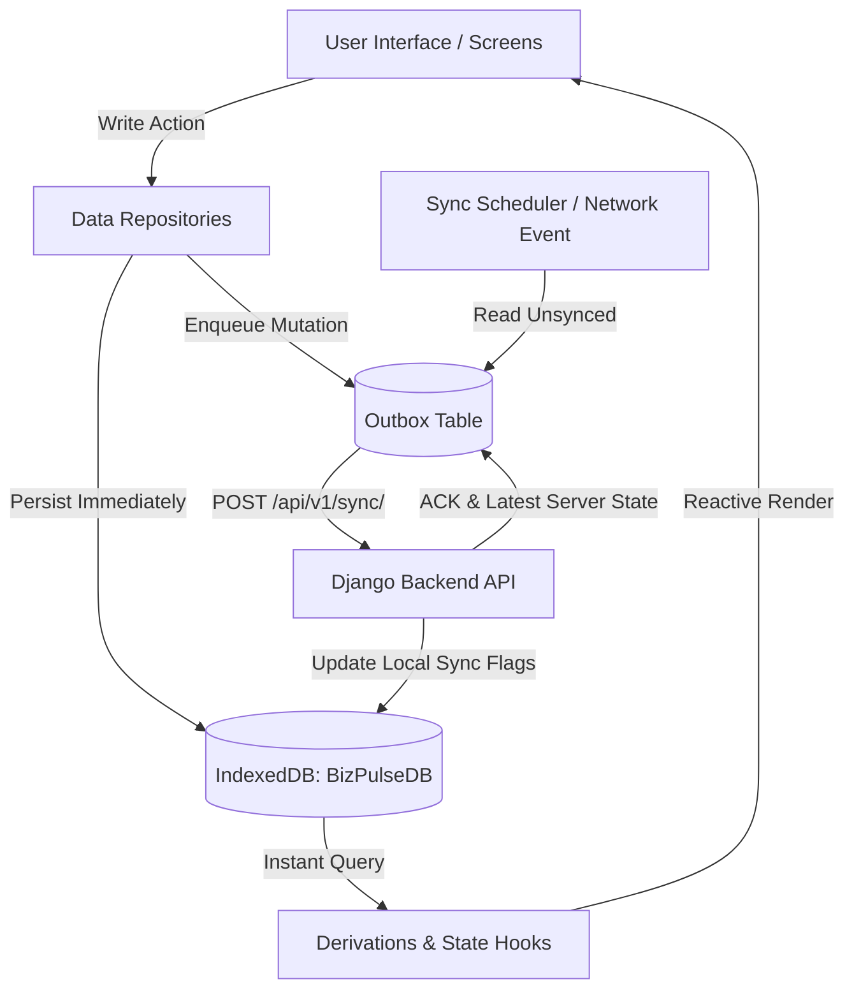

# 📊 BizPulse Frontend

> **Digital daily tally, debtor follow-ups, and automated financial clarity for Nigerian micro-traders — built 100% offline-first.**

BizPulse replaces tedious per-product bookkeeping apps with the macro tally traders already perform at the end of each business day. It works entirely offline on mobile and desktop browsers, queues mutations locally, generates instant financial metrics, and synchronizes transparently with the Django REST API when a network connection is available.

---

## 📑 Table of Contents

- [Core Philosophy & Research Findings](#-core-philosophy--research-findings)
- [Key Features](#-key-features)
- [Tech Stack](#-tech-stack)
- [Project Directory Structure](#-project-directory-structure)
- [Prerequisites](#-prerequisites)
- [Getting Started & Setup](#-getting-started--setup)
  - [1. Clone and Navigate](#1-clone-and-navigate)
  - [2. Install Dependencies](#2-install-dependencies)
  - [3. Configure Environment Variables](#3-configure-environment-variables)
  - [4. Start Development Server](#4-start-development-server)
- [Available npm Scripts](#-available-npm-scripts)
- [Offline-First & Sync Architecture](#-offline-first--sync-architecture)
  - [IndexedDB Schema (Dexie.js)](#indexeddb-schema-dexiejs)
  - [Outbox Queue Pattern](#outbox-queue-pattern)
  - [Conflict Resolution & Deduplication](#conflict-resolution--deduplication)
- [Voice & Pidgin Natural Language Parser](#-voice--pidgin-natural-language-parser)
- [Testing](#-testing)
- [Hackathon Demo & Evaluation Guide](#-hackathon-demo--evaluation-guide)
- [Troubleshooting & FAQ](#-troubleshooting--faq)

---

## 💡 Core Philosophy & Research Findings

Validated through direct field research with market stall owners, artisans, and provisions traders across Nigerian markets:

1. **Macro Totals, Not Micro-Cataloging:** Small traders calculate two numbers at closing: *total sold* and *how much of that was on credit*. They do not log individual biscuit packets or soap bars. BizPulse tracks the macro tally they already calculate.
2. **Privacy by Default:** Market stalls are public and noisy. Speaking debtor names and monetary amounts aloud is sensitive. Typing is the default; voice transcription is an optional, opt-in tool.
3. **Lender-Ready Bankability:** When approaching lenders or grant programs, traders lack verified historical records. BizPulse compiles daily tallies into clean, dated, exportable statements without any accounting friction.
4. **Resilient to Network Outages:** Market environments frequently have poor or zero cellular connectivity. The frontend must never fail or block on an unreachable API.

---

## ⚡ Key Features

- **⚡ End-of-Day Quick Tally:** Log total sales, credit extended, and expenses in under 30 seconds.
- **🎙️ Natural Language & Voice Parser:** Transcribe spoken voice inputs in English, Nigerian Pidgin, and mixed phrases (e.g., *"Sold 45k today, 12k on credit to Mama Ngozi, spent 3500 for transport"*).
- **📋 Customer & Debtor Tracking:** Automatically manages credit balances, payment logs, overdue alerts, and provides 1-tap WhatsApp and SMS reminder templates.
- **📈 Real-Time Macro Financial Dashboard:**
  - Revenue, Net Business Profit, Cash In Hand, and Outstanding Receivables.
  - Timeframe toggles (This Month vs. This Year) and period-over-period comparisons.
  - Smart, plain-language business insights.
- **📱 PWA & 100% Offline Capability:**
  - Installable to home screens via Web App Manifest and Service Worker (`sw.js`).
  - Powered by IndexedDB (`Dexie.js`) for instant reads and writes without waiting for server responses.
- **🔄 Outbox Synchronization:** Background sync engine pushes pending records to the backend and fetches server updates once back online.
- **📄 Lender Export Engine:** Client-side CSV generation (RFC 4180 compliant) exporting formatted financial statements ready for bank credit officers or microfinance partners.
- **🌱 Demo Data Generator:** 1-click seeder populating realistic 60+ days of Nigerian market operations, multiple active customers, credit histories, and partial repayments.
- **🌓 Adaptive Theme:** Instant light and dark mode toggles with zero-flash pre-render initialization.

---

## 🛠️ Tech Stack

| Technology | Purpose |
|---|---|
| **Next.js 16 (App Router)** | Modern React application framework with server/client boundaries |
| **React 19** | Core UI library with modern hooks and concurrent features |
| **TypeScript 5** | Strict type safety across domain types, repositories, and UI |
| **Tailwind CSS v4 & CSS Variables** | Bespoke design system optimized for mobile responsiveness and performance |
| **Dexie.js (v4)** | Minimal, type-safe client-side IndexedDB database layer |
| **Jest 29 & ts-jest** | Unit and integration testing suite with JSDOM environment |
| **Service Worker & Manifest** | PWA offline asset caching and home-screen installability |

---

## 📂 Project Directory Structure

```text
frontend/
├── app/                        # Next.js App Router pages and layouts
│   ├── app/                    # Main SPA AppShell wrapper (/app)
│   ├── dashboard/              # Dedicated Dashboard route
│   ├── followup/               # Debtors and Follow-ups route
│   ├── export/                 # Financial Export screen
│   ├── login/                  # User login screen
│   ├── signup/                 # User signup & onboarding screen
│   ├── forgot-password/        # Password recovery flow
│   ├── reset-password/         # Password reset callback
│   ├── globals.css             # Design system tokens, utilities, and components
│   ├── layout.tsx              # Root HTML layout, zero-flash theme script, PWA SW registration
│   └── page.tsx                # Marketing landing page
├── public/                     # Static assets and PWA artifacts
│   ├── icons/                  # PWA application icons (192x192, 512x512)
│   ├── manifest.json           # Web App Manifest for mobile installability
│   └── sw.js                   # Service Worker script for offline asset caching
├── src/
│   ├── api/                    # HTTP network clients & endpoints
│   │   ├── authApi.ts          # Authentication API calls (login, register, token refresh)
│   │   └── client.ts           # Authenticated API client with token interception & refresh
│   ├── data/                   # Data persistence, storage & sync engine
│   │   ├── db.ts               # Dexie.js database schema and indexed tables
│   │   ├── outbox.ts           # Offline mutation queue for reliable synchronization
│   │   ├── sync.ts             # Bidirectional background sync scheduler and conflict handler
│   │   ├── seed.ts             # Demo data seeder (60-day realistic trading records)
│   │   └── repositories/       # Typed local-first CRUD repositories:
│   │       ├── businessRepo.ts
│   │       ├── customerRepo.ts
│   │       ├── dailyTallyRepo.ts
│   │       ├── creditRecordRepo.ts
│   │       ├── repaymentRepo.ts
│   │       └── utils.ts
│   ├── domain/                 # Pure business logic and domain derivations
│   │   ├── types.ts            # Shared domain types (Business, Customer, DailyTally, etc.)
│   │   ├── derivations.ts      # Pure calculation engine (Revenue, Profit, Cash, Debt, Overdue)
│   │   ├── derivations.test.ts # Jest unit test suite for financial maths
│   │   ├── voiceParser.ts      # Speech-to-text regex & natural language parser (English & Pidgin)
│   │   ├── voiceParser.test.ts # Test suite for voice extraction patterns
│   │   ├── export.ts           # RFC 4180 CSV export builder
│   │   └── export.test.ts      # Test suite for data export generation
│   ├── state/                  # Reactive state management hooks
│   │   ├── authStore.ts        # Client JWT storage, token expiry checks, and silent refresh
│   │   ├── useBusiness.ts      # Current business state and persistence hook
│   │   ├── useDashboard.ts     # Aggregated dashboard data derivation hook
│   │   ├── useFollowUpList.ts  # Filtered debtor list and repayment hooks
│   │   ├── useSyncStatus.ts    # Online/offline and sync state listener
│   │   └── useTheme.ts         # Light/Dark mode state and toggle
│   └── ui/                     # UI components and screen layouts
│       ├── AppShell.tsx        # Responsive root app shell with tab navigation
│       ├── components/         # Reusable widgets (BottomNav, SyncIndicator, SettingsModal, etc.)
│       └── screens/            # Application views (HomeScreen, DashboardScreen, FollowUpScreen, etc.)
├── .env                        # Local active environment config
├── .env.example                # Example environment variables template
├── package.json                # Project dependencies and script runner
├── tsconfig.json               # TypeScript compiler configuration
└── next.config.ts              # Next.js build and runtime configuration
```

---

## 📋 Prerequisites

Before running the frontend, ensure your environment has:

- **Node.js**: `v18.18.0` or higher (Node `v20.x` LTS recommended).
- **npm**: `v9.x` or higher (or `pnpm` / `yarn`).
- **Modern Browser**: Google Chrome, Mozilla Firefox, Microsoft Edge, or Safari with IndexedDB support.

---

## 🚀 Getting Started & Setup

### 1. Clone and Navigate

If you haven't already cloned the repository, clone it and change directory into the `frontend` folder:

```bash
git clone <repository-url>
cd BizPulse/frontend
```

### 2. Install Dependencies

Install all required production and development dependencies:

```bash
npm install
```

### 3. Configure Environment Variables

Create your local `.env` configuration from the provided template:

```bash
# On Linux / macOS / Git Bash:
cp .env.example .env

# On Windows PowerShell:
Copy-Item .env.example .env
```

The default contents of `.env` are:

```env
# Base URL for the Django REST API backend
NEXT_PUBLIC_API_URL=http://localhost:8000
```

> **Note:** If you are running the frontend standalone without the backend, the application will function seamlessly in **offline-first local mode** using IndexedDB. Network sync attempts will gracefully fail in the background without interrupting UI interactions.

### 4. Start Development Server

Run the local development server:

```bash
npm run dev
```

Open your browser and navigate to:
**[http://localhost:3000](http://localhost:3000)**

---

## 📜 Available npm Scripts

In the `frontend` directory, you can run the following commands:

| Command | Description |
|---|---|
| `npm run dev` | Runs the development server with Next.js Webpack bundler on port `3000`. |
| `npm run build` | Compiles the production build, checks TypeScript types, and creates `.next` output. |
| `npm run start` | Starts the optimized production server (run after `npm run build`). |
| `npm run test` | Runs all Jest unit and domain tests (`*.test.ts`) in non-interactive mode. |
| `npm run test:watch` | Runs Jest in interactive watch mode for active TDD development. |
| `npm run lint` | Runs ESLint to check for code quality and formatting issues. |

---

## 🔄 Offline-First & Sync Architecture

BizPulse is architected around **local-first durability**. Writes never block on network availability.



### IndexedDB Schema (Dexie.js)

The local database (`BizPulseDB`, version 1) indexes the following collections:

- `users`: Authenticated user credentials and profile cached locally.
- `businesses`: Active business profile (`client_id`, `name`, `type`, `starting_cash`, `voice_enabled`).
- `customers`: Customer directory linked by `business_client_id`.
- `daily_tallies`: End-of-day sales, credit, and expense tallies. Compound index `[business_client_id+date]` ensures one tally per business day.
- `credit_records`: Credit transactions indexed by customer and date.
- `repayments`: Payments made against specific credit records.
- `outbox`: Client-only table storing queued mutations (`entity`, `client_id`, `payload`, `attempts`).

### Outbox Queue Pattern

When any create or update operation occurs:
1. A unique client ID is generated via `crypto.randomUUID()`.
2. The entity is immediately written to its respective IndexedDB table with `synced: false`.
3. An entry is recorded in the `outbox` table specifying the entity type, client ID, and operation timestamp.
4. When `startSyncScheduler()` triggers (on network reconnect or periodic polling), items in `outbox` are batched to the Django backend sync endpoint.
5. Upon successful server acknowledgement, local records are marked `synced: true` and cleared from the outbox.

### Conflict Resolution & Deduplication

- **Deduplication:** Every entity uses client-generated UUIDs (`client_id`). If the backend receives an already processed `client_id`, it idempotently updates the record rather than creating a duplicate.
- **Last Write Wins:** Changes are evaluated against `updated_at` ISO timestamps.

---

## 🎙️ Voice & Pidgin Natural Language Parser

Located in [`src/domain/voiceParser.ts`](file:///c:/Users/USER%20PC/Documents/BizPulse/frontend/src/domain/voiceParser.ts), BizPulse includes a built-in natural language parser tailored to Nigerian market vocabulary.

### Supported Patterns

- **Sales / Revenue:** `"Sold 40000"`, `"Sales 15k"`, `"I sell 80k today"`, `"Total sold 25,000"`.
- **Expenses:** `"Spent 2500"`, `"Expenses 5k"`, `"Fuel 1200"`, `"Transport 800"`.
- **Credit Lines:** `"10k credit to Mama Ngozi"`, `"Credit Alhaji Ibrahim 15000"`, `"Bola owes 5k"`.
- **Shorthand:** Recognizes `k` multipliers (e.g. `15k` = `15,000`) and currency symbols (`₦`, `naira`).

---

## 🧪 Testing

The frontend codebase maintains high test coverage for core financial algorithms, voice recognition, and export compliance.

To execute the test suite:

```bash
npm run test
```

### What is tested?

1. **Financial Derivations ([`src/domain/derivations.test.ts`](file:///c:/Users/USER%20PC/Documents/BizPulse/frontend/src/domain/derivations.test.ts)):**
   - Revenue and total sales across single and multi-day tallies.
   - Business Profit / Net Result calculations.
   - Cash position factoring cash-in-hand, credit deductions, and collected repayments.
   - Overdue calculation, aging categories (`0-7`, `8-30`, `31+` days), and repayment deductions.
2. **Voice & Text Parsing ([`src/domain/voiceParser.test.ts`](file:///c:/Users/USER%20PC/Documents/BizPulse/frontend/src/domain/voiceParser.test.ts)):**
   - Number extraction (`k` shorthand, commas, naira symbols).
   - Pidgin and English phrase matching for sales, costs, and debtor names.
3. **Data Export Validation ([`src/domain/export.test.ts`](file:///c:/Users/USER%20PC/Documents/BizPulse/frontend/src/domain/export.test.ts)):**
   - RFC 4180 CSV escaping (handling quotes, line breaks, and commas).
   - Period-based tally and debtor reconciliation in export statements.

---

## 🏆 Hackathon Demo & Evaluation Guide

To test or demo the frontend during evaluation:

### Option A: Instant 1-Click Demo Evaluation

1. Open **[http://localhost:3000](http://localhost:3000)**.
2. If not logged in, click **"Sign In"** or create a quick account (e.g., test email/password).
3. If presented with onboarding, complete the 2-step setup (Business name and starting cash).
4. In the Dashboard header or Quick Actions, click **"Load Demo Data"**.
5. The application instantly loads **60+ days of historical Nigerian market tallies**, 6 active debtor accounts, overdue records, and repayments.
6. Explore the **Dashboard** metrics, switch between **This Month** and **This Year**, and view the **Follow-ups** list.

### Option B: Offline Resilience Demonstration

1. Open Google Chrome DevTools (`F12` or `Ctrl + Shift + I`).
2. Navigate to the **Network** tab and change throttling to **Offline** (or toggle Airplane Mode on your device).
3. Notice the top status badge changes to **Offline (Working Locally)**.
4. Go to **Today's Tally** and submit a new daily entry (e.g., Sales: 50,000, Credit: 10,000, Expenses: 4,000).
5. The entry saves instantly with zero lag. Derivations and metrics update immediately in the local database.
6. Switch Network back to **Online**. The background sync automatically wakes up and dispatches the outbox queue to the server.

### Option C: Lender Statement Export

1. Open the navigation menu and select **Export**.
2. Select your desired period (**This Month**, **This Year**, or **All Time**).
3. Review the preview and click **Download CSV**.
4. Open the downloaded file in Microsoft Excel or Google Sheets to inspect the formatted financial history.

---

## ❓ Troubleshooting & FAQ

### Port `3000` is already in use
Run the dev server on an alternate port:
```bash
npx next dev -p 3001
```

### How to reset local test data completely
To start fresh with a completely empty local IndexedDB database:
1. Open Chrome DevTools (`F12`).
2. Go to **Application** > **Storage** > **IndexedDB**.
3. Right-click `BizPulseDB` and select **Delete database**.
4. Refresh the page (`F5`).

### Connecting to the Django Backend
Ensure your Django backend is running on `http://localhost:8000`:
- Check that `NEXT_PUBLIC_API_URL=http://localhost:8000` in `.env`.
- Ensure CORS headers on the Django backend allow requests from `http://localhost:3000`.
- Verify JWT tokens are issued via `/api/v1/auth/login/` or `/api/v1/auth/register/`.

---

## 👥 Contributors & Hackathon Team

- **Product & Frontend Engineering:** Built for the **Borderless Bytes Hackathon** by StacStart (*FinTech & Commerce Track*).
- **Inquiries:** Refer to [Project Brief v3.3](../BizPulse-Project-Brief-v3.3.md) for full product roadmap and business specifications.
